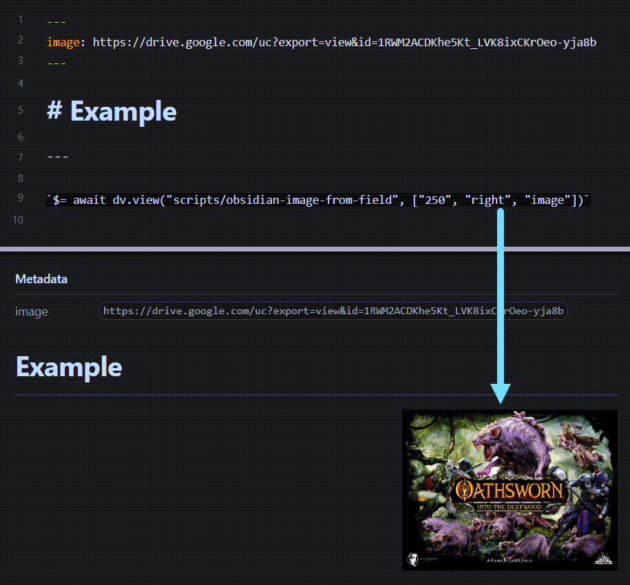

# 🌅 obsidian-image-from-field
_DataviewJS Script to render a Markdown image using a local field for the source_

I often include an image URL for a note in my frontmatter or inline field. This allows me to render it using `dataview` queries in other notes. This is handy, but sometimes I also want that image to be displayed on its note as well. I could easily just embedd the image as well as having it in a field, but this creates duplication, and is harder to maintain if the URL needs to be updated. This `dataviewjs` script will read the URL from your supplied field and reder the image using that source. Additionally, there are some quality of life improvements as it also accepts size and alignment values.

## Instalation
1. Install the `Dataview` plugin and enable `JavaScript Queries`
  
2. copy the [scripts/obsidian-image-from-field](./scripts/obsidian-image-from-field) folder to your Obsidian vault (suggested to save it to a "./scripts" folder).

## Usage
- Use the following in your note where you want the image to be displayed:

    ```javascript
    `$= await dv.view("= scripts/obsidian-image-from-field", ["<size>", "<alignment>", "<field>"])`
    ```

    `size` ⇢ number (eg: 250, 300, 825, etc.)
    `alignment` ⇢ `left`, `center`, `right`
    `field` ⇢ name of field that holds the image source url (can be inline or frontmatter field)

<br>

---

<br>

## Example

  